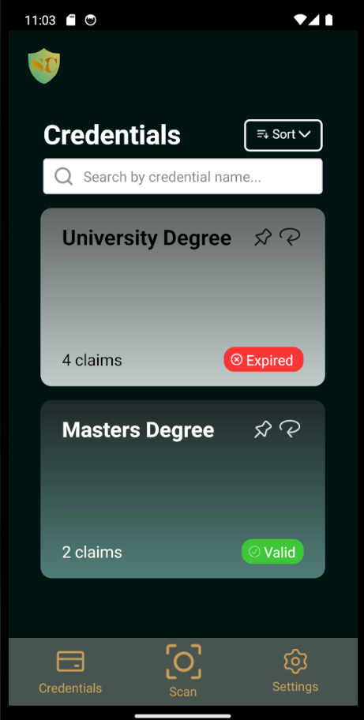
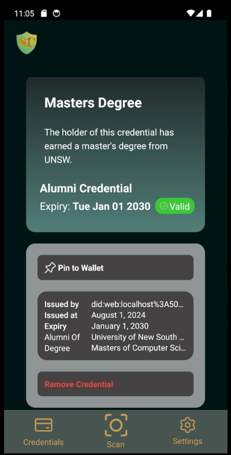
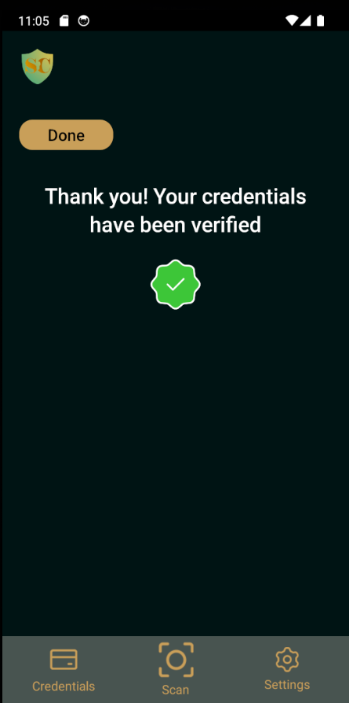
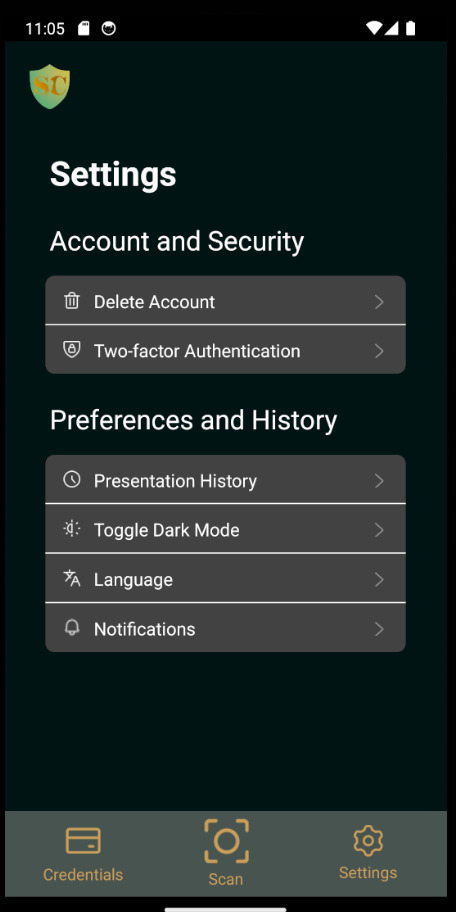

[](https://classroom.github.com/online_ide?assignment_repo_id=15169870&assignment_repo_type=AssignmentRepo)

# Application Preview
<div style="display: flex; flex-wrap: wrap; flex-direction: row; align-content: center">
  
  
  
  
  
  
  
  
  
</div>

# Project Structure

- backend: Identity Owner Backend (per user)
- frontend: Identity Owner Frontend (per user)
- issuer: Issuer API (per issuer)
- service-provider: Service Provider API (per service provider)
- did: DID web server for uploading DID Documents (for general use)
- lib: Library with helper functions for issuer/service-provider/identity owner
  agents (for general use)
- cli: Contains a command line interface for service-provider and issuer, for
  testing/demonstration purposes and out-of-band functions (for general use)

Please refer to the README.md in each folder for more information.

# How to run (with docker)

```bash
docker-compose up
```

Note: You are unable to view the frontend as it requires an emulator (e.g. Android Studio) to run the frontend. You can
view the frontend by
running the frontend locally.

# How to run (without docker)

- Running the DID server (required for the majority of CLI commands)

```bash
cd did
npm install
npm run build && npm start # or npm run dev
```

- Installing the library (required for backend, issuer and service-provider)

```bash
cd lib
npm install
npm run build
```

- Running the backend

```bash
cd backend
npm install
npm run build && npm start # or npm run dev
```

- Running the frontend

```bash
cd frontend
npm install
npm start
```

- Running the issuer agent

```bash
cd issuer
npm install
npm run build && npm start # or npm run dev
```

- Running the service provider agent

```bash
cd service-provider
npm install
npm run build && npm start # or npm run dev
```

